<div align="center">

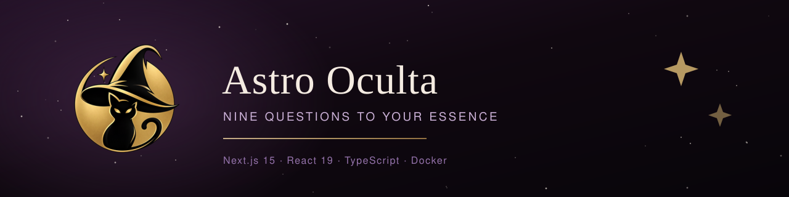

Um quiz de personalidade que não pergunta a sua data de nascimento.
Nove perguntas de numerologia, e no fim o signo que combina com as suas escolhas.

[](LICENSE.md)   

**[Ver o site](https://astrooculta.nerdresolve.com)** · [As telas](#as-telas) · [Como funciona](#como-o-quiz-funciona) · [Rodar](#rodar) · [Licença](#licença)

</div>

---

## O que é

Um site completo de astrologia, numerologia e tarô, construído para uma
taróloga. O centro é um **quiz de personalidade**: nove perguntas, uma por
vibração numerológica, doze alternativas cada — uma por signo, escondidas de
quem responde.

O resultado traz o signo dominante, o percentual de cada um dos doze e uma
leitura escrita. Sem login, sem cadastro, sem banco de dados: o resultado
viaja na URL e o link pode ser compartilhado.

<div align="center">
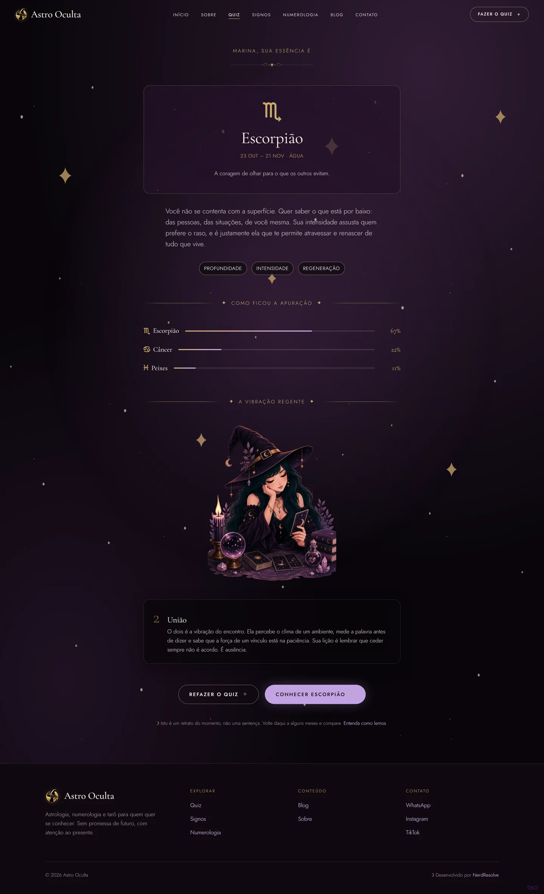
</div>

---

## Como o quiz funciona

O visitante nunca vê a que signo cada alternativa pertence. Ele escolhe pelo
texto, e a apuração faz o resto.

```
9 perguntas × 12 alternativas = 108 textos
     │
     ├─ cada alternativa pertence a um signo (oculto)
     ├─ cada pergunta nasce de uma vibração numerológica (1 a 9)
     │
     ▼
signo dominante · percentual dos doze · vibração regente
```

### Três decisões que valem registro

**Os percentuais somam exatamente 100.** Arredondar cada parte isolada não
fecha a conta: nove respostas divididas em nove signos dariam 11% × 9 = 99%.
A apuração usa o método do maior resto, e há teste para isso.

**As alternativas são embaralhadas com semente fixa.** Elas nascem na ordem
zodiacal, e exibi-las assim entregaria o jogo — a primeira opção seria sempre
Áries. Embaralhar com `Math.random()` quebraria a hidratação, porque servidor
e cliente sorteariam ordens diferentes. A semente é o índice da pergunta.

**A vibração regente vem da apuração**, não de um número arbitrário: é a soma
das perguntas em que o signo dominante foi escolhido, reduzida a um dígito
(45 → 9). É a redução teosófica usada de fato em numerologia.

---

## As telas

Dois temas: **cosmic** (escuro, o padrão da marca) e **lunar** (claro). A
escolha fica no `localStorage` e é aplicada por script síncrono no `<head>`,
antes da primeira pintura, para a página não piscar.

<table>
<tr>
<td width="50%"><a href="docs/telas/01-home-desktop.webp" title="ver a página inteira">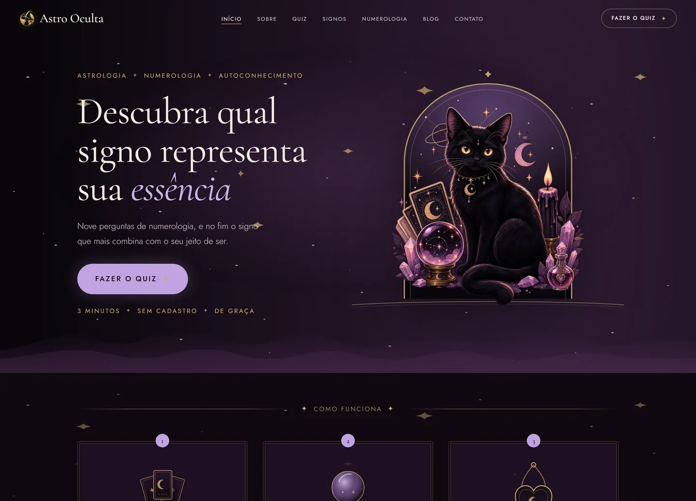</a><br><sub><b>Home</b> · tema cosmic, o padrão da marca</sub></td>
<td width="50%"><a href="docs/telas/02-home-claro-desktop.webp" title="ver a página inteira"></a><br><sub><b>Home</b> · tema lunar, a mesma tela</sub></td>
</tr>
<tr>
<td><a href="docs/telas/03-quiz-desktop.webp" title="ver a página inteira">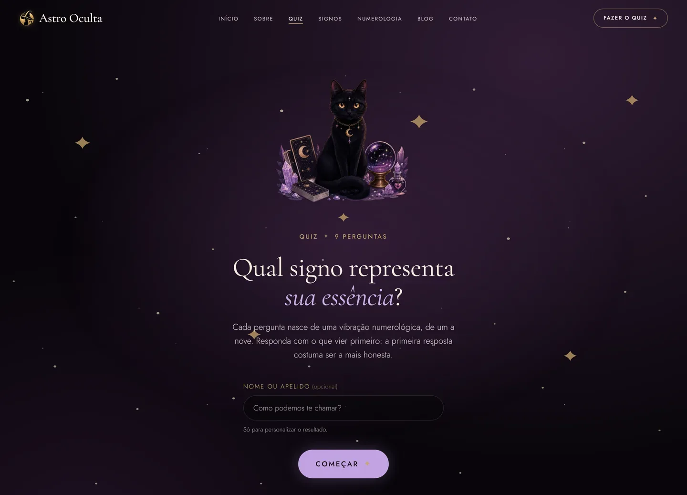</a><br><sub><b>Quiz</b> · o nome é opcional</sub></td>
<td><a href="docs/telas/04-resultado-desktop.webp" title="ver a página inteira">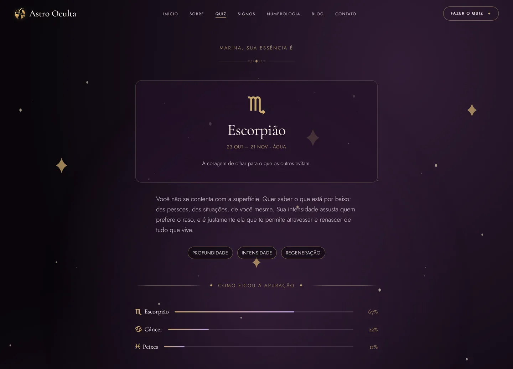</a><br><sub><b>Resultado</b> · percentuais que somam 100</sub></td>
</tr>
<tr>
<td><a href="docs/telas/05-signos-desktop.webp" title="ver a página inteira">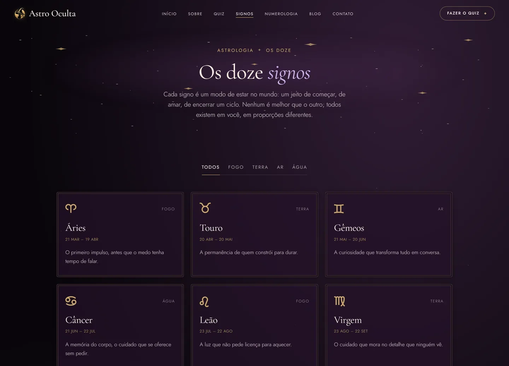</a><br><sub><b>Signos</b> · os doze, filtráveis por elemento</sub></td>
<td><a href="docs/telas/06-signo-desktop.webp" title="ver a página inteira">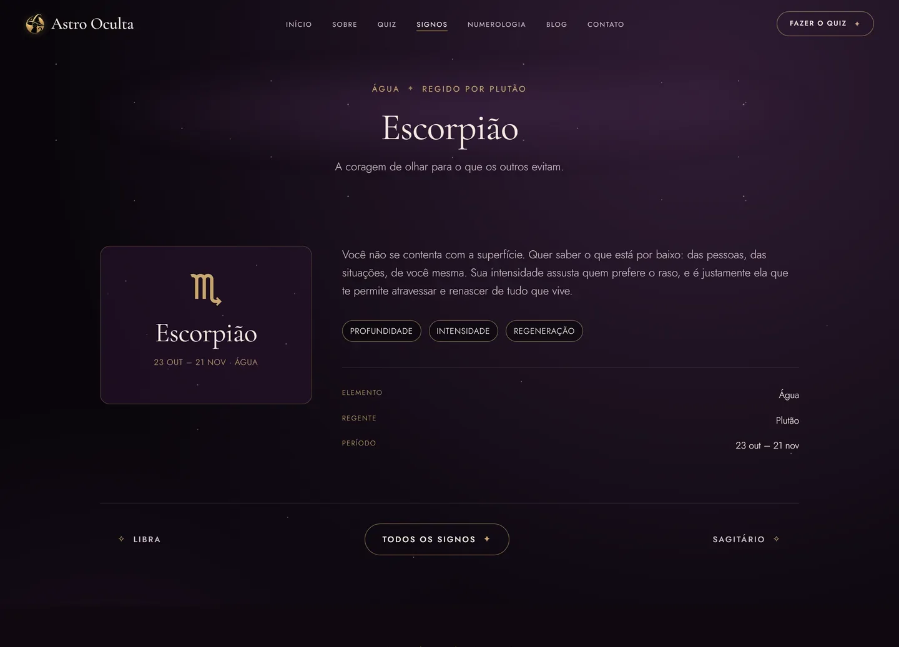</a><br><sub><b>Signo</b> · doze rotas geradas no build</sub></td>
</tr>
<tr>
<td><a href="docs/telas/07-numerologia-desktop.webp" title="ver a página inteira">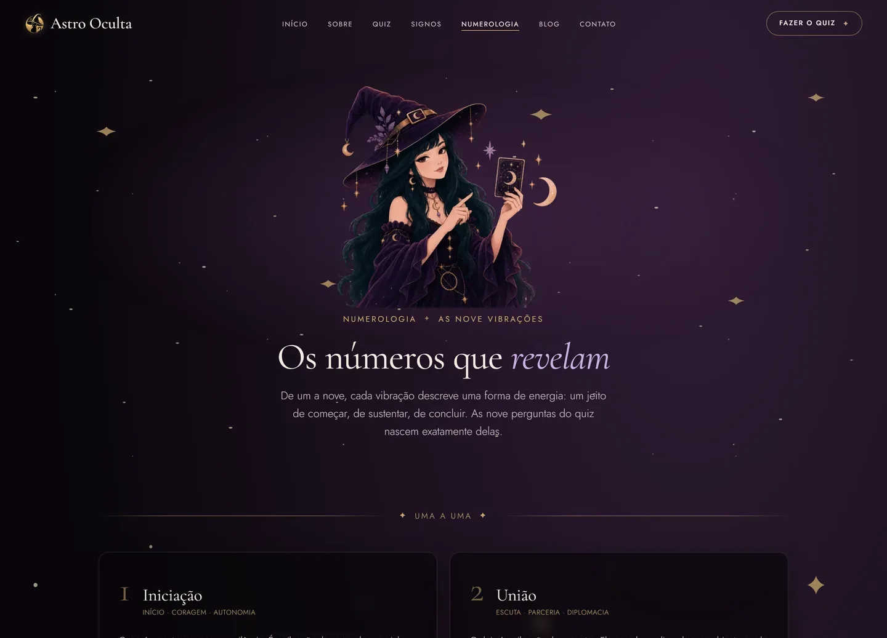</a><br><sub><b>Numerologia</b> · as nove vibrações</sub></td>
<td><a href="docs/telas/08-sobre-desktop.webp" title="ver a página inteira"></a><br><sub><b>Sobre</b> · tema lunar</sub></td>
</tr>
<tr>
<td><a href="docs/telas/09-blog-desktop.webp" title="ver a página inteira"></a><br><sub><b>Blog</b> · listagem dos textos</sub></td>
<td><a href="docs/telas/10-contato-desktop.webp" title="ver a página inteira">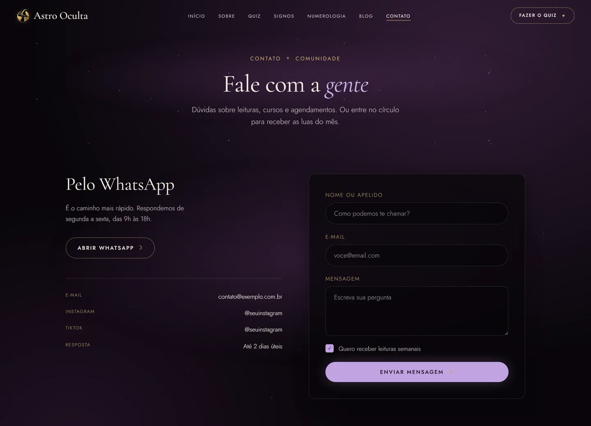</a><br><sub><b>Contato</b> · formulário validado</sub></td>
</tr>
</table>

### No celular

<table>
<tr>
<td width="25%"><a href="docs/telas/01-home-mobile.webp" title="ver a página inteira"></a><br><sub><b>Home</b></sub></td>
<td width="25%"><a href="docs/telas/03-quiz-mobile.webp" title="ver a página inteira">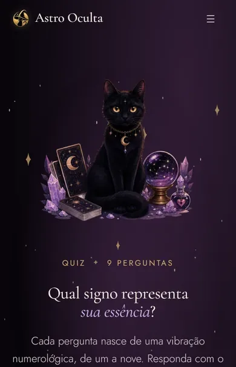</a><br><sub><b>Quiz</b></sub></td>
<td width="25%"><a href="docs/telas/04-resultado-mobile.webp" title="ver a página inteira">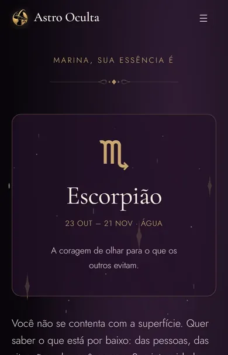</a><br><sub><b>Resultado</b></sub></td>
<td width="25%"><a href="docs/telas/05-signos-mobile.webp" title="ver a página inteira">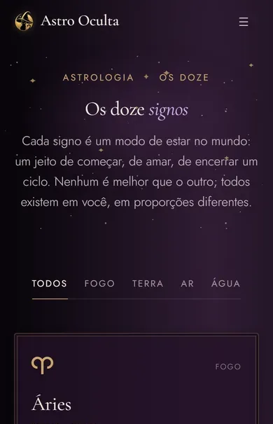</a><br><sub><b>Signos</b></sub></td>
</tr>
</table>

> Não são mockups: é o site rodando. `npm run shots` abre cada rota no
> Chromium, em 1440×900 e 390×844, e salva duas versões — a página inteira e
> este recorte do topo, todos na mesma proporção para a grade não abrir buraco.
> **Clique em qualquer imagem** para ver a página completa.

---

## Por dentro

```
apps/frontend/
  src/
    app/                    rotas (App Router) — cada página é um page.tsx fino
      quiz/resultado/       resultado lido da URL, compartilhável
      signos/[sign]/        doze rotas geradas em build
      api/health/           sonda do healthcheck do compose
    components/
      ds/                   design system portado para TypeScript (24 componentes)
      brand/                logo e arte da marca
    content/                signos, vibrações, perguntas, textos do site
    features/               uma pasta por tela: view + css
    lib/quiz/               apuração do quiz — regra pura, testada
    styles/astro-oculta-ds/ design system, cópia fiel (não editar)
infra/                      Dockerfile, compose, Caddyfile
docs/telas/                 as capturas deste README
```

As páginas em `app/` só delegam; a tela mora em `features/*-view.tsx`. O que é
interativo (`"use client"`) fica restrito ao quiz, ao filtro de signos, ao
formulário de contato e à moldura — todo o resto é server component.

### Escolhas de arquitetura

| Decisão | Por quê |
|---|---|
| **Sem banco de dados** | O resultado viaja na URL. Nada é gravado, nada precisa ser protegido. |
| **Sem Tailwind** | O design system é CSS puro com tokens em custom properties. Tailwind brigaria com ele. |
| **Caddy, não nginx** | HTTPS automático via ACME embutido (sem certbot nem cron) e um Caddyfile de ~40 linhas onde o `nginx.conf` passaria de 100. |
| **Túnel Cloudflare** | A conexão sai da máquina para a borda: sem IP público, sem porta aberta, sem certificado próprio. |
| **`next/font`** | As fontes entram com preload e sem layout shift, em vez do `@import` do Google Fonts, que bloqueia a primeira pintura. |

---

## Rodar

```bash
npm install
npm run dev            # http://localhost:3000
```

Portões de qualidade, todos offline:

```bash
npm run verify         # typecheck + 22 testes + lint
```

### Com Docker

O `up` sobe a aplicação atrás do **Caddy**, que termina HTTP/HTTPS.

```bash
cp infra/.env.local.example infra/.env.local   # uma vez
npm run up                                     # http://localhost:8080
npm run logs
npm run down
```

Em produção, num servidor exposto à internet:

```bash
cp infra/.env.example infra/.env               # preencha o domínio
npm run up:prod                                # portas 80/443, HTTPS automático
```

### Publicar por túnel Cloudflare

Sem IP público nem porta aberta. Exige `infra/.env.tunnel` com o token do
túnel — o arquivo fica fora do Git.

```bash
cp infra/.env.tunnel.example infra/.env.tunnel  # cole o TUNNEL_TOKEN
npm run publish                                 # app + Caddy + túnel
npm run publish:logs
```

O túnel fica sob **perfil** do Compose: `npm run up` não o levanta. Publicar é
sempre um comando explícito.

### Gerar os assets

```bash
npm run logo    # favicons, ícone do cabeçalho e imagem de compartilhamento
npm run art     # ilustrações da marca: PNG grande → WebP em dois tamanhos
npm run shots   # as capturas deste README (precisa do site no ar)
```

---

## Configuração

Nenhum `.env` entra no repositório. Os `.example` são o modelo.

| Arquivo | Para quê |
|---|---|
| `infra/.env` | Produção: domínio, e-mail do ACME, portas |
| `infra/.env.local` | Máquina local: sobrepõe o de cima com `:80` |
| `infra/.env.tunnel` | Token do túnel Cloudflare — **segredo** |

Contato e redes sociais entram no build por `NEXT_PUBLIC_*`. Sem eles o site
sobe com valores de exemplo e funciona igual — é o que este repositório
mostra, já que o telefone real é de uma pessoa.

---

## Pendências conhecidas

- **O formulário de contato não envia.** Valida, dá retorno e para aí — não há
  backend. O ponto de envio está isolado e comentado em
  `features/contact/contact-view.tsx`.
- **Blog sem páginas de post.** A listagem usa os quatro textos de
  `content/site.ts`; `/blog/[slug]` ainda não existe.
- **Fontes substitutas.** Cormorant Garamond e Jost no lugar das famílias
  licenciadas do design original.
- **`sharp` com aviso de segurança** (`npm audit`): é dependência transitiva do
  Next para otimização de imagem. A correção sugerida força o Next 16, uma
  quebra de major — fica para uma atualização deliberada.

---

## Licença

**© 2026 NerdResolve. Todos os direitos reservados.** Veja [LICENSE.md](LICENSE.md).

O repositório é público para avaliação técnica e demonstração de portfólio. O
código pode ser lido e estudado; não há licença de uso, cópia ou
redistribuição. A marca **Astro Oculta** e o conteúdo autoral pertencem à
titular.

---

<div align="center">


**Astro Oculta** — desenvolvido por [NerdResolve](https://nerdresolve.com)

Quer um site assim? **contact@nerdresolve.com**

</div>
